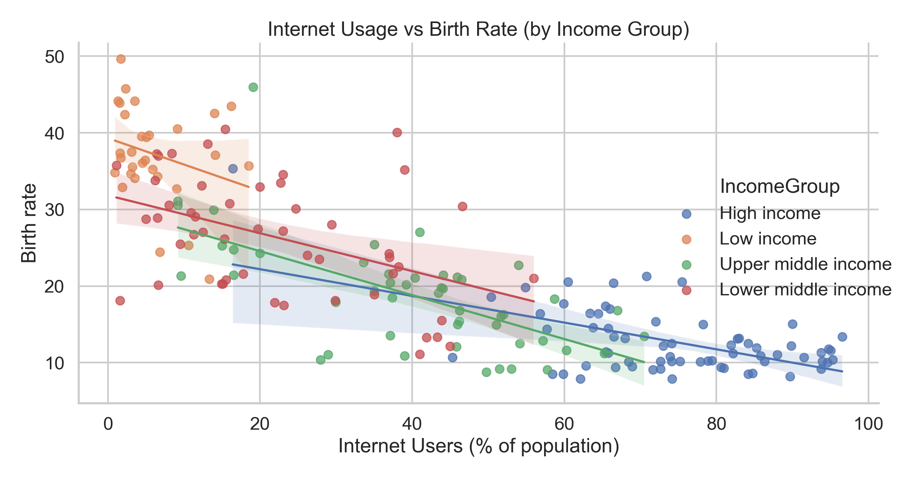

# 🌍 Country Economy Analysis



A hands-on data analysis project exploring how internet usage and income levels relate to birth rates across countries. This project focuses on turning raw data into meaningful insights using Python, SQL, and visualization.

---

##  What This Project Does

This project analyzes global economic data to understand:
- how internet access differs across income groups  
- how digital adoption connects with population trends like birth rates  

It also demonstrates a complete data analysis workflow — from data cleaning to insights and reporting.

---

##  Key Questions

- How does internet usage vary across income groups?  
- Is there a relationship between internet access and birth rates?  
- Which countries are leading or lagging in digital adoption?  

---

##  Tools Used

- Python (Pandas, NumPy)  
- Matplotlib / Seaborn  
- SQL  
- Jupyter Notebook  
- Git & GitHub  

---

##  Dataset Overview

- **195 countries**
- Key fields:
  - CountryName  
  - CountryCode  
  - BirthRate  
  - InternetUsers  
  - IncomeGroup  

---

##  Quick Access

- Report → `reports/REPORT.md`  
- Charts → `reports/figures/`  
- Notebook → `notebooks/country_economy_analysis.ipynb`  
-  SQL Queries → `sql/analysis_queries.sql`  

---

##  Highlights

- Clean and reproducible data workflow  
- Data validation (missing values, duplicates, types)  
- Income group segmentation  
- Correlation analysis between internet usage and birth rate  
- Exported charts for quick insights  

---

## Key Insights

- Internet usage ranges from **0.9% to 96.5%** across countries  
- High-income countries have **~74% median internet usage**, while low-income countries are around **4.5%**  
- Birth rates are much lower in high-income countries (**11.3**) vs low-income (**36.9**)  
- Strong negative relationship between internet usage and birth rate (**r = -0.816**)  
  *(Important: this shows correlation, not causation)*  

---

## What This Shows

This project highlights how:
- Digital access is strongly linked with economic development  
- population trends differ significantly by income level  
- data can be used to uncover real-world patterns and support decision-making  

---

##  Skills Demonstrated

- Data cleaning and validation  
- Exploratory Data Analysis (EDA)  
- Data visualization and storytelling  
- Grouping, aggregation, and ranking  
- Writing business-focused SQL queries  

---

##  Resume:

- Analyzed global data for 195 countries using Python and created visual insights on internet usage and birth rates  
- Built segmented comparisons across income groups using statistical summaries  
- Identified and explained a strong correlation between internet access and population trends  

---

##  How to Run

```bash
pip install -r requirements.txt
python -m scripts.export_charts
Jupyter notebook


👤 Author:
Tharun Sammeta
