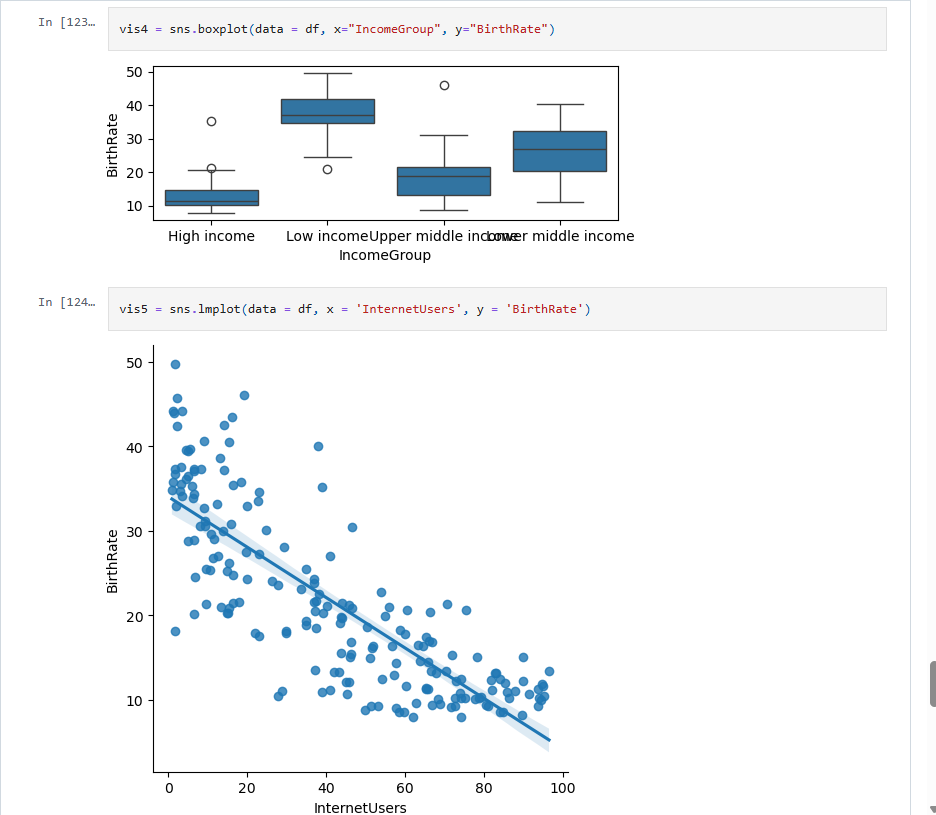

# Country Economy Analysis (Pandas EDA)

Early-career Data Analyst portfolio project exploring the relationship between **internet usage**, **birth rate**, and **income group** across countries using Pandas and Seaborn/Matplotlib.

## Quick links
- **Report**: `reports/REPORT.md`
- **Figures**: `reports/figures/`
- **Notebook**: `notebooks/country_economy_analysis.ipynb`
- **SQL**: `sql/analysis_queries.sql`

## Project highlights
- Data loading with **reproducible, relative paths**
- Practical EDA: missing values, duplicate checks, basic type validation
- Grouped summaries by `IncomeGroup`, ranked comparisons, and correlation EDA
- Clean, saved charts for recruiter review

## Quantified insights (high-level)
- **Internet usage ranges from 0.9% to 96.5%** across 195 countries.
- **Median internet usage**: high income **74.1%** vs low income **4.5%**.
- **Median birth rate**: high income **11.3** vs low income **36.9**.
- **Overall relationship**: Internet usage vs birth rate has Pearson \(r = -0.816\) (EDA; not causation).

## Skills demonstrated
- **Python (pandas)**: data loading, validation checks, grouping/aggregation, ranking
- **Visualization**: Matplotlib/Seaborn charts with clear titles/labels
- **EDA & communication**: segmentation by `IncomeGroup`, correlation analysis, recruiter-style reporting

## Data Analyst resume bullet points
- Analyzed a 195-country dataset in Python (pandas) and created 5 publication-ready charts to explain differences in internet usage and birth rates across income groups.
- Built segmented summaries using robust statistics (median/IQR), highlighting a high-income median internet usage of **74.1%** vs **4.5%** for low-income countries.
- Quantified the internet–birth rate relationship using correlation analysis (Pearson \(r = -0.816\)) and documented limitations and next steps in a stakeholder-ready report.

## How to run
1. Create and activate a virtual environment (optional but recommended).
2. Install dependencies:

```bash
pip install -r requirements.txt
```

3. Export charts to `reports/figures/`:

```bash
python -m scripts.export_charts
```

4. Open the notebook:

```bash
jupyter notebook
```

## SQL (portfolio component)
This project includes a SQL file with a table schema and business-focused analysis queries:
- **SQL file**: `sql/analysis_queries.sql`
- Includes examples of **GROUP BY**, **ORDER BY**, **HAVING**, **CASE WHEN**, and **ranking/segmentation** queries using window functions.

## Repository structure
```
country-economy-analysis/
├── data/
│   └── data.csv
├── notebooks/
│   └── country_economy_analysis.ipynb
├── reports/
│   ├── REPORT.md
│   └── figures/
│       ├── 01_internet_users_distribution.png
│       ├── 02_birthrate_by_income_group.png
│       ├── 03_internet_vs_birthrate_by_income.png
│       ├── 04_top10_internet_users.png
│       └── 05_income_group_medians.png
├── sql/
│   └── analysis_queries.sql
├── scripts/
│   └── export_charts.py
├── .gitignore
├── requirements.txt
└── README.md
```

## Preview (generated charts)
- `reports/figures/03_internet_vs_birthrate_by_income.png`
- `reports/figures/02_birthrate_by_income_group.png`

## Author
Tharun Sammeta
